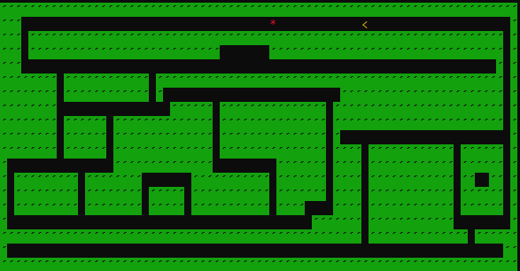
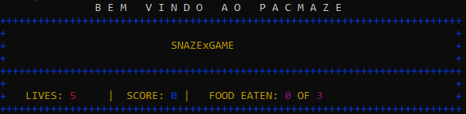
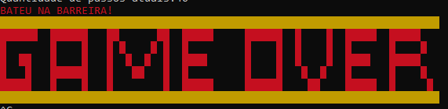
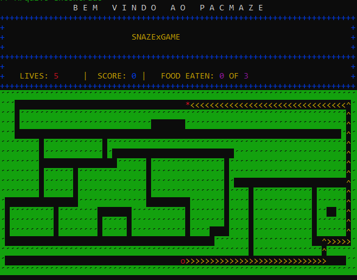

# LP1 Projeto 3 - Snaze


------------------------------------------------

### Sumário

1. Introdução
2. Modularização
      Level
      Pacman
      Player IA
      View
3. Entradas
4. Carregamentos
5. Mecânica
      random 
      new level
6. Debug
7. Interface
      Mapa
      Header
      Game Over
8. Debug
9. Compilação

---------------------------------------------------

# INTRODUÇÃO:

O Snaze é um projeto implementado na disciplina de Linguagem e Programação I (IMD - UFRN 2022.1) onde os alunos da turma T01 tiveram que desenvolver uma simulação de um Game Arcade semelhante ao Snake (Jogo da Cobrinha). Nesse contexto, o jogo terá um número determinado de fases, ao menos um labirinto, uma fruta e um jogador movido por uma Inteligência Artificial (IA) para encontrar, percorrer e coletar a fruta no labirinto.
Como modelo reduzido do programa, primeiramente, tivemos que desenvolver uma simulação de um pacman. 
	
Para ver o jogo rodando, assista aos vídeos abaixo:
	
[Pacmaze - IA FIND (normal e  debug)](https://www.youtube.com/watch?v=JttOw6YBAds)
	
[Pacmaze - IA RANDOM (normal e debug)](https://www.youtube.com/watch?v=727JBExVnCs)
   
# MODULARIZAÇÃO:

Aqui, tivemos que pensar na forma mais limpa e dinâmica de dividir as informações e uni-las em um único escopo principal. Sendo assim, dividimos essa sessão em sub-tópicos que explicam com mais detalhes cada classe desenvolvida e seu objetivo no processamento desse trabalho.

## LEVEL:
Responsável em gerar a mecânica de rodadas atuais do jogo, o Level é um conjunto de importantes informações que tem como principais objetivos: 1. Carregar o mapa atual, 2. Gerar as rodadas, 3. Gerenciar os status das comidas do pacman, 4. Indicar o estado do pacman no jogo.

Primeiramente, ele deve inicializar com as informações do arquivo de onde o mapa está instaurado, a quantidade de linhas e colunas que o mapa terá, a quantidade de comidas no level, indicar em ordem a posição atual do Level e também, iniciar o processamento do mapa. 

	Com esses dados, ele deve retornar para a classe principal do game, em um tipo Level, as informações do mapa, estado do pacman (se ele foi encontrado ou não no mapa), o estado do jogo (se ele continua dentro do caminho ou bateu em barreira) e outras pequenas funcionalidades que mechem com a mecanica do level. 

## PACMAN:
A classe possui a base das principais informações do Pacman: Localização do pacman, quantidade de vidas e um container que armazena as comidas recolhidas pelo mesmo. Além disso, ele indica ao programa qual é a posição da cabeça.

Em geral, essa seção tem o princípio de enviar os dados do jogador para a classe principal do jogo, e nela, fazer atualizações e extração de dados que serão usados posteriormente para o placar do jogo mostrado na interface. 

## PLAYER IA:
A classe Player foi pensada como um intermédio para o pacman, ou seja, como um próprio jogador e suas funcionalidades. Enquanto o pacman guarda suas informações básicas e _importantíssimas_, o player calcula o caminho do pacman até a comida na IA find, decide como o pacman vai caminhar na IA aleatória, guarda os futuros movimentos do jogador, monitora quantas vezes o pacman pode tentar chegar a comida na IA random…Enfim! Nesta modelagem, a classe Player é como o próprio jogador, e o _pacman_ por si mesmo é acessado de modo indireto por meio da classe Player.

Inicialmente, um objeto pacman é criado no SnakeGame, e por meio de referência ele é compartilhado com a classe player, a qual gerencia todas as mudanças no pacman. 
Este ponto foi criado desta forma pensando na inserção de um objeto Snake futuramente, com a produção do _mode snaze_. Ou seja, a classe Player seria uma base _default_ para qualquer tipo de jogador. Não está implementada desta maneira nesta versão deste trabalho, mas se foi pensado inicialmente para ser assim :)

### __Pontos Importantes__
O __find_solution()__ foi implementado seguindo o algoritmo de backtracking de busca em profundidade. Pensamos em implementar com a busca em largura, porém pelo tempo permanecemos nesta implementação e ocasionalmente o pacman _sometimes_ escolhe caminhos ENORMES e desnecessários. Mas, tá explicado aqui o porquê.

O __find_solution__aleatory()__ é o find_solution na versão da IA RANDOM. Foi implementado da seguinte forma: Caso o pacman não esteja em cima da comida, ou seja, caso ele não tenha encontrado, o pacman vai recolher todas as possíveis posições que ele PODE IR. Assim, um container guardará os possíveis movimentos e ele chama um rand() para escolher um deles aleatoriamente. Perceba que dessa maneira, o pacman nunca morrerá, pois todas as posições são válidas. Assim, estabelecemos um limite de chamadas da função find. <br>
> Opa! Obs: A função find_solution() só é chamada uma vez a cada round, pois já calcula toda a roda do pacman até a comida. Já a função find_solution__aleatory() por sua vez, é chamada A CADA ITERAÇÃO DO ROUND, uma vez que a cada passo que dá, o pacman possui diferentes _possíveis posições_ que pode escolher para prosseguir o seu caminho. <br>
Voltando, estabelecemos assim um limite de vezes que o método pode ser chamado. Este limite é 700. Se o método for chamado mais de 700 vezes, um atributo de error é acionado! 😬🤯 O que isso significa? O atributo é do tipo booleano, e ativa no método find_solution_aleatory() a seleção de posições inacessíveis ao pacman ao container de movimentos. Isso consequentemente, deixa uma margem de escolhas que podem fazer o pacman morrer. 😞

## VIEW: 
A classe interface foi um acréscimo que criado para pensarmos em uma forma mais organizada de separar o “front” do “back”. Então, como no conceito de Dev WEB (MVC) temos a View que tem o propósito de processar os dados contidos nas matrizes trazidas da classe principal para serem apresentadas ao terminal de acordo com o algoritmo.

Cada método criado é utilizado para um propósito de apresentação diferente, como:

1. Mapa do Jogo: Converte os valores numéricos da matriz em cores e elementos.
2. Header: Converte elementos chaves (identificadores) do arquivo txt, trazido da classe principal com componentes da classe Level, e, de acordo com o algoritmo, no caso, alguns elementos específicos do arquivo são substituídos por posições onde estarão outros dados do game, como: Quantidade de comidas, vidas, score e também quantidade de comidas recolhidas. 
3. Game Over: No Game Over  temos o processamento direto das informações do arquivo txt para o método. Assim como os outros, os elementos do arquivo são convertidos para cores e outros elementos de interface que simulem um pixel. 

Portanto, todos os métodos desenvolvidos na classe View são levados para a classe principal, especificamente para a renderização do jogo (render) para serem apresentados.

# ENTRADAS:

Nas entradas, temos dois modos de jogo. Você pode executar tanto no modo Find (possui uma solução onde o pacman seguirá para encontrar a food) ou, o modo random (percorre um caminho aleatório para chegar a comida), como mostrado abaixo:
```
./snaze ../data/maze1.txt -mode pacmaze -ia find
./snaze ../data/maze1.txt -mode pacmaze -ia random
```
Por fim, há também o modo debug, onde o jogo será rodado em uma versão de debug que mostra exatamente os passos que o pacman fará e como suas ações afetam a jogabilidade.

```
./snaze ../data/maze1.txt -mode pacmaze -ia [random|find] -d
```

Todos tem uma ordem em comum, primeiro, encontra o caminho do arquivo, depois indique o modo de jogo sendo -ia (a IA que irá controlar) e se ela será random ou find, por fim, se for execução do debug coloque o -d no final.

# CARREGAMENTOS:

O carregamento do game é realizado logo na inicialização encontrada na classe principal (SnakeGame). Aqui, ele deve recolher as três principais informações da primeira linha do arquivo do mapa (maze.txt) e distribuí-las em um vetor de inteiros, onde as instâncias indicam cada informação:  values_map[0] - Quantidade de linhas do mapa, values_map[1] - Quantidade de colunas, values_map[2] - Quantidade de comidas que cada rodada terá.

Com esses dados, o próximo passo é enviar as três instâncias para o Level atual que irá utilizá-las para fazer o processamento do mapa (realizado logo no construtor) e trazer novamente a classe principal pela função ``` get_process_map ``` que processará o mapa em sua versão matriz e em números identificados (0, 1, 3, 4) para o atributo ```m_maze_assembly``` que guardará esse labirinto para ser transferido à classe View e renderizar na tela. 

Deixando claro que, o estado da matriz do labirinto sempre é modificada à medida que o jogo roda, onde, o método da classe level: ```update_assembler_maze()``` é chamado e recolhe da posição nova do pacman, da comida, seu modo de jogo, e entregar para a classe principal uma nova matriz do labirinto a ser utilizada. 

Outro carregamento utilizado e muito importante para o game é do Header (O placar do jogo atual). Onde, descrito um pouco na sessão View, iremos falar mais a fundo no próximo parágrafo.

Bem, o Header além de ter o processamento realizado pela View, seus dados são sempre mantidos e atualizados na classe principal, mais precisamente, metade deles através de uma conexão com a classe Pacman, onde são recolhidas a quantidade de vida do pacman e as frutas recolhidas até então, em exceção, os dados de scores e a quantidade de comidas do Level são levadas pelos próprios atributos contidos na classe principal(values_map[2] e m_score).

# MECÂNICA:
Nessa seção, iremos apresentar as três principais mecânicas utilizadas na classe principal do game, a fim de realizar as principais atualizações e progresso contínuo do Snaze.
	
## RANDOM:
Encontra-se na classe principal o método ```random_food```, essa, terá a seguinte estrutura logo abaixo, e irá retornar um par de coordenadas onde estará a comida no round.

```
std::pair<int,int> SnakeGame::random_food(){ 
    int rand_inst = std::rand()%m_level[m_current_level].get_coords_free().size();
    return m_level[m_current_level].get_coords_free()[rand_inst];
}
```
Como podemos ver, para a random_food funcionar, precisamos gerar a posição aleatória da instância de um container que armazena todos os caminhos livres (value 1) do labirinto. Esse container se encontra na própria Level atual e é trazida pelo método get_coords_free().

Com a coordenada escolhida, o próximo passo que o jogo fará é atribuir esses valores aos atributos da posição da comida na classe principal, para assim, serem atualizadas junto com o labirinto.

## NEW LEVEL:
Para podermos criar um novo level, uma idéia pensada foi na criação de cointainers desses levels, para teste, foi criado um vector do tipo Level que a cada transação de Nível do game ele irá criar uma nova instância de reincrementar novas informações do jogo a medida deu seu estado/situação atual. Sendo assim, criamos um atributo na classe principal chamada ```m_current_level```, que serve como um contador de instancias que incrementa +1 a cada level, e assim, o restante do processamento é feito de acordo com esse valor atual do contador. 

# DEBUG
A funcionalidade de debug foi implementada no modo pacmaze na IA find e na IA random neste projeto. Esta funcionalidade permite que o usuário visualize todo o caminho que o pacman está percorrendo durante o jogo. Com isso, as setinhas indicam a direção da última movimentação do pacman. Sendo:
	^ - CIMA
	> - DIREITA
	< - ESQUERDA
	v - BAIXO
	Dessa forma, integrando melhor a harmonia do pacman com o labirinto.
	
Na IA find inicialmente a tela mostra todo o caminho do pacman, e depois, o método do Player, ```update_assembler_maze(...true…)``` vai atualizando o mapa de acordo com o caminho que o pacman já percorreu. Assim, para cada rodada, o mapa é limpo e o pacman vai deixando seu rastro.
Já na IA random, inicialmente a tela mostra o pacman na posição inicial, após isso o método ```update_assembler_maze(...true…)``` vai atualizando o mapa de acordo com o caminho que o pacman já percorreu até o momento. 
Neste modo de debug, quando o pacman bate na parede, aqui como citado anteriormente, só ocorrerá caso o modo random esteja ativo e o pacman não tiver encontrado a comida, a parede por si só muda a sua cor para vermelho. Assim, indicando que houve uma colisão.
O método debug é muito eficaz para avaliar as distâncias que estão sendo percorridas pelo pacman, e analisar a eficiência do algoritmo implementado no método find_solution(). Além de, é claro, ser uma forma visual de ver o código rodando :)

# INTERFACE:
## MAPA:

## PLACAR:

## GAME OVER:

	
## DEBUG:
Na versão Debug as setas indicam o caminho que o pacman encontrou e irá fazer para chegar a comida.



# Compilar e executar

```bash
   mkdir build
   cd build
```
```bash
   cmake ..
   cmake --build . --target
```

A sessão [Interface](#11interface) foi implementada com sucesso, inclusive o parâmetro -d.
<br> Então, apenas ao digitar:


```
  ./snaze
```
O usuário tem acesso às possíveis linhas de comandos para rodar o jogo :)

<div align="center">

#### Pacmaze
</div>

Para rodar com o modo find:
```bash
  ./snaze ../data/maze1.txt -mode pacmaze -ia find
```
Para rodar com o modo aleatório:
```bash
  ./snaze ../data/maze1.txt -mode pacmaze -ia random
```
Para rodar com o modo de debug em qualquer um deles: adicione o -d no final.
```bash
  ./snaze ../data/maze1.txt -mode pacmaze -ia [random|find] -d
```

# Versão de Compilação automatizada

Temos aqui também a compilação automática com os seguintes comandos:
1. Para o modo find normal:
```
bash execute_find.sh
```
2. Para o modo find debug:

```
bash execute_fdebug.sh
```
3. Para o modo random normal:

```
bash execute_random.sh
```
4. Para o modo random debug:

```
bash execute_rdebug.sh
```

> ps, é preciso que já tenha o cmake instalado em um diretório build

